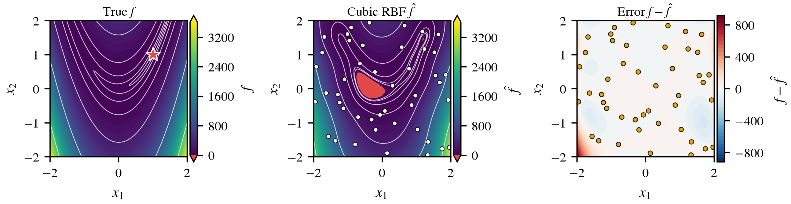

# Surrogate Modeling of the Rosenbrock and Trid Functions

Assignment 1 for **AE 541 – Digital Twin in Modern Engineering** (KFUPM, first semester 2026).

The assignment asks a simple question: can a cheap model guide a design decision reliably? To answer it, I treat two known test functions as if they were expensive simulations. I sample each one 60 times, fit surrogate models, and then check how far each model can be trusted. Because the true functions are known, every prediction can be checked against the truth, which a real CFD or FE study never allows.

| | Function | Domain | Global minimum |
|---|---|---|---|
| Part A (common to the class) | Rosenbrock, $f=100(x_2-x_1^2)^2+(1-x_1)^2$ | $[-2,2]^2$ | $f=0$ at $(1,1)$ |
| Part B (my assigned function) | Trid, $f=(x_1-1)^2+(x_2-1)^2-x_1x_2$ | $[-4,4]^2$ | $f=-2$ at $(2,2)$ |

Three surrogates are compared for each function:
- polynomial regression, with its degree chosen by cross-validation on the training set only;
- a cubic radial basis function (RBF) interpolant;
- a Gaussian process (GP).

The study covers:
- the design of experiments;
- a leakage-free train/test split;
- validation;
- side-by-side error maps;
- GP uncertainty;
- learning curves;
- surrogate-based optimization with verification;
- an extrapolation test.

## What I found

- **Cross-validation recovers the true form of both functions.** Rosenbrock is exactly a degree-4 polynomial and Trid a degree-2 one, and five-fold CV on the 45 training points picks those degrees without being told. The fitted coefficients match the exact expansions to about $10^{-13}$.
- **The GP is the best model that doesn't assume the answer.** Its test NRMSE is $7.8\times10^{-6}$ (Rosenbrock) and $1.0\times10^{-6}$ (Trid). Its optima land 0.013 and $6\times10^{-4}$ from the true minima.
- **The RBF fails in an instructive way.** On Rosenbrock it creates a spurious minimum with $\hat f=-16.8$, although the function is never negative. Only checking the candidate against the true function exposes it.
- **Extrapolation is dangerous.** Outside a reduced training box, the RBF and GP errors grow by factors of 70 to 2300.
- **Trid by hand.** The Trid minimum follows from $\nabla f = 0$, a $2\times2$ linear system. The fitted quadratic and every numerical search reproduce it.



*Rosenbrock, cubic RBF: true function, surrogate on the same color scale, and error. The red region is where the surrogate predicts impossible negative values.*

The full write-up is in [`submission/202510630_Bahaa_Karawia.pdf`](submission/202510630_Bahaa_Karawia.pdf), in AIAA journal format. A version in the KFUPM report style is in [`report_normal/`](report_normal/).

## Repository layout

```
code/
  202510630_Bahaa_Karawia.py   the whole study in one script
  outputs/                     figures (PDF + PNG), CSV tables and summary.json it writes
report_common/                 report text shared by both versions (body, abstract, references)
report_AIAA/                   AIAA journal version (includes the AIAA LaTeX template files)
report_normal/                 KFUPM-style version
submission/                    the two files that were submitted
tools/compare_summary.py       checks a fresh run against the committed results
reproduce.ps1, reproduce.sh    one-command rebuild
```

## Reproducing the results

You need Python 3.11. The package versions are pinned in `requirements.txt`, and a LaTeX distribution with `latexmk` is only needed to rebuild the PDFs.

On Windows:

```powershell
powershell -ExecutionPolicy Bypass -File reproduce.ps1
```

On Linux or macOS:

```bash
bash reproduce.sh
```

Either script:
1. creates a virtual environment in `.venv`;
2. installs the pinned packages;
3. runs the study, which takes about two minutes and regenerates everything in `code/outputs`;
4. rebuilds both reports if LaTeX is available.

If you prefer to do it by hand:

```bash
python -m venv .venv
.venv/bin/python -m pip install -r requirements.txt      # .venv\Scripts\python on Windows
.venv/bin/python code/202510630_Bahaa_Karawia.py
```

**Why the results come out the same every time.**
- Every random draw comes from one master seed (7), set in the configuration block at the top of the script together with every other setting.
- On the same machine, two runs produce identical numbers.
- On a different operating system or CPU, the values that sit at round-off level (around $10^{-13}$, such as the polynomial errors) can change in their last digits. That is expected and means nothing.
- A GitHub Actions workflow reruns the study from scratch on a clean Linux machine for every push. It then compares the fresh results with the committed ones, using `tools/compare_summary.py`.
  - Everything agrees within 1%, except the GP uncertainty-versus-error correlations.
  - Those correlations are built from quantities at their numerical floor, so they shift between platforms. For example, the Trid rank correlation is 0.27 on Windows and 0.20 on Linux.
  - The checker gives them a wider tolerance, and the report discusses it.

## Notes

- The workflow follows the course reference notebook on the Himmelblau function. The Latin hypercube, the cubic RBF system and the GP set-up are adapted from it; everything specific to Rosenbrock and Trid is my own.
- The assignment brief, the reference notebook and the university logos belong to the course and are not included. The KFUPM-style report compiles without the logos.
- The AIAA template files in `report_AIAA/` are the official ones distributed by AIAA through Overleaf.
- This is graded individual coursework, shared for reference. Please don't submit it, or parts of it, as your own work.

Bahaa Karawia, PhD student, Aerospace Engineering, KFUPM
